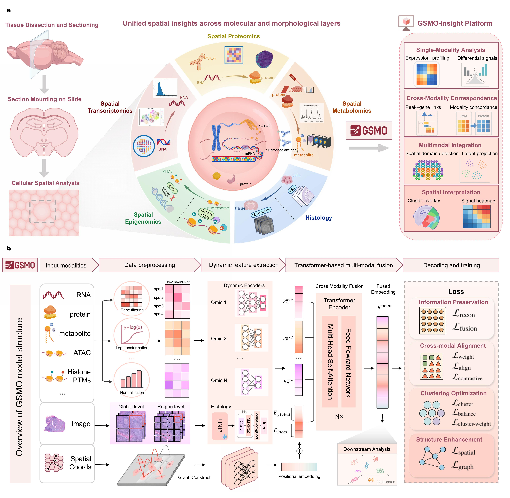

# GSMO: An Open and Scalable Platform for Generalist Spatial Multi-Omics Integration

  

## ✨ Overview

**GSMO (Generalist Spatial Multi-Omics Integration)** is an open and scalable platform designed for integrating multiple spatial omics datasets. The code provided here enables the reproduction of experiments described in the paper: "GSMO: An Open and Scalable Platform for Generalist Spatial Multi-Omics Integration."

This repository contains:
- The model code for GSMO
- Jupyter notebook files to reproduce the experimental results from the paper
- Preprocessed datasets for various experiments

## 📚 Table of Contents
1. [Requirements](#-requirements)
2. [Dataset](#dataset)
3. [Installation](#installation)
4. [Usage](#usage)
5. [Reproducing the Evaluation Results](#reproducing-the-evaluation-results)
6. [Directory Structure](#directory-structure)
7. [License](#license)

## 🔍 Requirements

### Software Requirements
- **Python** 3.10.16
- **PyTorch** 2.6.0+cu124
- **CUDA** 12.4
- **cuDNN** version 90100

### Python Packages
You can install the required dependencies using the following `requirements.txt`:

```bash
numpy==1.26.4
scipy==1.11.4
statsmodels==0.14.2
threadpoolctl==3.4.0
shapely==2.0.4
pyproj==3.6.1
geopandas==0.14.4
rasterio==1.3.10
fiona==1.9.6
spatialdata==0.3.0
xarray==2024.10.0
anndata==0.10.5
einops==0.6.0
hdbscan==0.8.40
matplotlib==3.8.4
pandas==2.2.3
pillow==11.1.0
scanpy==1.11.0
timm==0.9.8
torch==2.6.0
torchvision==0.21.0
tqdm==4.64.1
opencv_python==4.6.0.66
scikit-image==0.21.0
scikit-learn==1.5.2
scikit-misc==0.5.1
squidpy==1.6.5
```

## 📘 Dataset

The datasets used in this work are available on [Google drive](https://drive.google.com/drive/folders/1pd-37LSp8pW4bp-QdFz20LaxRwEHArIt?usp=sharing).

Please download the dataset and store it in a directory named `data`. The required directory structure is as follows:

```bash
data/
├── fivemodal
│   ├── 5M_20um_RNA
│   │   ├── 5M_20um_RNA
│   │   ├── GSM8494158_5M_20um_RNA.tar.gz
│   │   ├── GSM8494158_5M_20um_spatial_RNA.tar.gz
│   │   ├── scRNA.h5ad
│   │   └── spatial
│   └── best_model.pth
│   └── ...
├── Human_Lymph_Node
├── metabolism
├── spatial ATAC-RNA-seq
├── spatial-mux-seq
└── Triplet_Omics_Data
└── ...
```

## 📌 Installation

1. Clone the repository:
```bash
git clone https://github.com/locokun/GSMO.git
cd GSMO
```

2. Create a virtual environment:
```bash
conda create -n GSMO python=3.10.16
conda activate GSMO
```

3. Install the required dependencies. To ensure a stable environment and avoid dependency resolution errors, please install the dependencies step by step as follows:
```bash
# 1) Numerical base
pip install --no-deps numpy==1.26.4 scipy==1.11.4 statsmodels==0.14.2

# 2) Geospatial stack (versions with manylinux wheels)
pip install --no-deps shapely==2.0.4 pyproj==3.6.1 rasterio==1.3.10 fiona==1.9.6
pip install --no-deps geopandas==0.14.4 xarray==2024.10.0 spatialdata==0.3.0

# 3) Remaining dependencies
pip install -r requirements.txt
```

4. Download the dataset from [the google drive](https://drive.google.com/drive/folders/1pd-37LSp8pW4bp-QdFz20LaxRwEHArIt?usp=sharing) and extract it into a `data` folder in your project directory.
   
5. Download the evaluation results from [the google drive](https://drive.google.com/drive/folders/1pd-37LSp8pW4bp-QdFz20LaxRwEHArIt?usp=sharing) and extract it into a `result` folder in your project directory.

## 🔑 Usage

### Tutorials (Jupyter notebooks)

To run the Jupyter notebooks that reproduce the experiments from the paper:

1. Start a Jupyter notebook server:

```bash
pip install jupyter
```

2. To reproduce the experiments described in the paper, open the Jupyter notebooks (spatial ATAC-RNA-seq_mousebrain.ipynb, tripletomics_simulated_data.ipynb, human_lymphnode.ipynb, hippocampus_meatabolism.ipynb, etc.), each corresponding to a specific experiment.

   You can either run them in order or open only the notebook related to the experiment you’re interested in.

   In the upper-right corner of Jupyter, select the kernel **GSMO (Python 3.10.16)** that you created earlier.

   Then run the cells sequentially by clicking **Run** for each block, or choose **Run All** from the toolbar to execute the entire notebook at once.

### Python Script

We also provides an example Python script **train_gsmo_on_tripletomics_data.py** that demonstrates the full workflow for training and testing the model on a dataset.
It serves as a complementary resource to the Jupyter tutorial notebook, showing how to run GSMO in a script-based environment for easier automation and reproducibility.

The script includes:

- Loading and preprocessing input data (e.g., RNA features)

- Running model training and evaluation

- Saving the outputs and metrics for downstream analysis

You can run this python script using the following run command:
```bash
python train_gsmo_on_tripletomics_data.py --gpu 0 --seed 100 --data_dir "data/Triplet_Omics_Data" --out_dir "outputs_triplet" --max_epochs 2000 --patience 200 --check_interval 200 --nmi_threshold 0.98
```

## 📊 Reproducing the Evaluation Results

The `Quantitative_evaluation/` folder contains jupyter notebooks used to reproduce the benchmarking outcomes and quantitative results reported in the paper. 

Before running these notebooks, make sure you have already downloaded the experiment outputs in the result/ directory by following the previous steps. 

Once the result folder is prepared, you can open and run the notebooks inside Quantitative_evaluation/ to produce the evaluation figures.

These notebooks will automatically generate comparison plots of GSMO and other baseline methods across all experiments.

## 🗂 Directory Structure

Here's an overview of the directory structure:

```bash
GSMO/
├── data/                     # Downloaded dataset
│   ├── fivemodal/            # Folder for fivemodal data
│   ├── Human_Lymph_Node/     # Folder for human lymph node data
│   ├── metabolism/           # Folder for metabolism data
│   ├── spatial ATAC-RNA-seq/ # Folder for spatial ATAC-RNA-seq data
│   ├── spatial-mux-seq/      # Folder for spatial mux-seq data
│   └── Triplet_Omics_Data/   # Folder for triplet omics data
│   └── ...
├── Figure/                   # Metrics plots generated by Quantitative evaluation
├── gsmo/                     # Model code for GSMO
├── Quantitative_evaluation/  # Jupyter notebooks for reproducing metrics plots
├── result/                   # Downloaded results
├── images/                   # Model Function and Structure Diagram
├── notebooks                 # Jupyter notebooks for experiments
├── train_gsmo_on_tripletomics_data.py # Python script using GSMO
├── requirements.txt          # Python dependencies
├── README.md                 # This file
└── LICENSE                   # License information
```

## 🤝 License

This repository is licensed. See the LICENSE file for more information.

## 👏 Acknowledgements
This project adapts and builds upon the following work:

- **MISO** — Nature Methods, 2025
  
  Paper: *Resolving tissue complexity by multimodal spatial omics modeling with MISO*.
  
  Repo: [https://github.com/kpcoleman/miso](https://github.com/kpcoleman/miso)
  
  We were inspired by its overall modeling framework and design principles.
  
  **COPYRIGHT AND PERMISSION NOTICE — Penn Software MISO**
  
  Copyright (C) 2022 The Trustees of the University of Pennsylvania. All rights reserved. 

